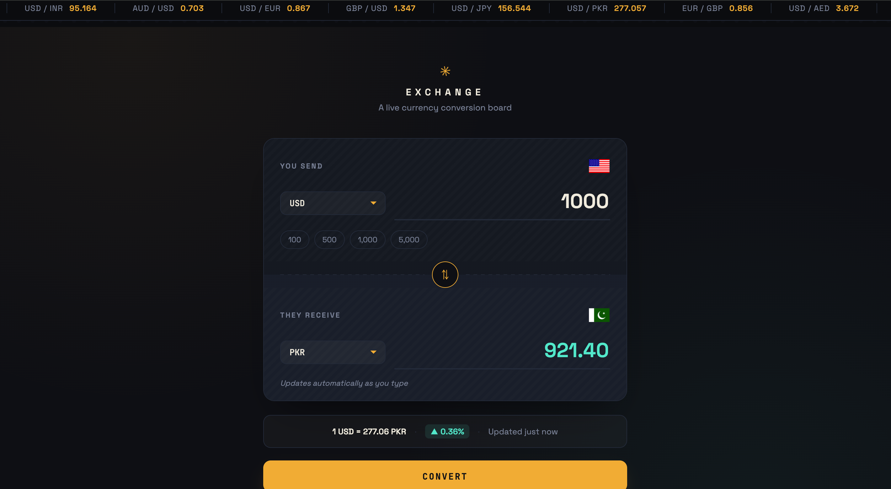

# 💱 Exchange — Live Currency Conversion Board

A sleek, terminal/split-flap inspired currency converter that fetches **live exchange rates** for 150+ currencies, complete with an animated ticker tape, country flags, and a real-time USD → PKR rate strip.

<p align="center">
  
  
  
</p>

<!-- 🔴 Replace this with an actual screenshot or GIF of the app once it's live -->
<p align="center">
  
</p>

<p align="center">
  <a href="#">🔗 Live Demo</a> ·
  <a href="#features">✨ Features</a> ·
  <a href="#tech-stack">🛠 Tech Stack</a> ·
  <a href="#getting-started">🚀 Getting Started</a>
</p>

---

## 📖 Overview

**Exchange** is a front-end only currency conversion board built with vanilla HTML, CSS, and JavaScript — no frameworks, no build tools. It pulls live foreign exchange rates from a free, open-source currency API and presents them inside a custom-designed "split-flap board" UI, complete with a scrolling rate ticker, country flags, quick-amount chips, and a live USD/PKR indicator strip.

The project was built as a UI/UX-focused exercise in working with real-time REST APIs, dynamic DOM generation, and custom CSS design systems (no UI libraries used).

---

## ✨ Features

- 🌍 **150+ currencies** — every ISO currency code is dynamically populated into the dropdowns at runtime, each mapped to its corresponding country flag.
- 🔄 **Live conversion** — fetches real-time exchange rates and converts on demand via the Convert button.
- 🏳️ **Dynamic flag rendering** — flags update instantly when a currency is changed, using the [FlagsAPI](https://flagsapi.com).
- 📈 **Scrolling rate ticker** — an animated marquee header showing live rates for major currency pairs (USD/EUR, GBP/USD, USD/JPY, USD/PKR, etc.).
- 💹 **Live USD → PKR strip** — a dedicated always-visible exchange rate readout with trend indicator.
- ⚡ **Quick-amount chips** — one-tap presets (100 / 500 / 1,000 / 5,000) to speed up common conversions.
- 🔁 **Swap control** — a rotating swap button rail between the "You send" and "They receive" panels.
- 🎨 **Custom design system** — a dark, editorial "ticket board" aesthetic built entirely with hand-written CSS: custom properties, gradients, perforation textures, and motion-reduced fallbacks.
- ♿ **Accessibility touches** — visible focus states, `prefers-reduced-motion` support, and semantic form elements.
- 📱 **Responsive layout** — adapts cleanly down to small mobile viewports.

---

## 🛠 Tech Stack

| Layer | Technology |
|---|---|
| Structure | **HTML5** (semantic markup, `<select>`/`<input>` form controls) |
| Styling | **CSS3** — custom properties (design tokens), Flexbox, `@keyframes` animations, `repeating-linear-gradient` textures, media queries |
| Logic | **Vanilla JavaScript (ES6+)** — `fetch` API, `async/await`, DOM manipulation, event delegation |
| Fonts | [Space Grotesk](https://fonts.google.com/specimen/Space+Grotesk), [JetBrains Mono](https://fonts.google.com/specimen/JetBrains+Mono), [Orbitron](https://fonts.google.com/specimen/Orbitron) via Google Fonts |
| Exchange Rate Data | [@fawazahmed0/currency-api](https://github.com/fawazahmed0/currency-api) — a free, open-source, no-API-key-required currency conversion API served via jsDelivr CDN |
| Flags | [FlagsAPI](https://flagsapi.com) — free country flag image API |
| Hosting-ready | Pure static site — deployable on GitHub Pages, Netlify, or Vercel with zero configuration |

No frameworks, no bundlers, no dependencies to install — it runs straight in the browser.

---

## 📂 Project Structure

```
exchange/
├── index.html      # Markup — layout, panels, ticker bar, footer
├── style.css       # All styling — design tokens, animations, responsive rules
├── script.js       # App logic — API calls, DOM population, event handlers
└── README.md
```

---

## ⚙️ How It Works

1. **On load**, `script.js` populates both currency `<select>` dropdowns from a local `countryList` map (currency code → ISO country code), defaulting to **USD → PKR**.
2. The **ticker bar** loops through a predefined list of popular currency pairs and fetches each pair's live rate from the currency API, rendering them into a continuously scrolling track.
3. Selecting a new currency updates the corresponding **flag** instantly via `flagsapi.com`.
4. Clicking **Convert** fetches the latest rate for the selected `from → to` pair and multiplies it by the entered amount to update the result field.
5. A dedicated call also keeps the **USD → PKR rate strip** at the bottom in sync with the live market rate.

---

## 🚀 Getting Started

No installation or build step required — it's plain HTML/CSS/JS.

```bash
# 1. Clone the repository
git clone https://github.com/<your-username>/exchange.git

# 2. Move into the project folder
cd exchange

# 3. Open index.html in your browser
#    (or use a local dev server, e.g. the VS Code "Live Server" extension)
```

> 💡 Tip: Because the app uses `fetch`, opening `index.html` directly usually works fine, but for the smoothest experience use a local server (Live Server, `python -m http.server`, etc.) to avoid any browser CORS quirks.

---

## 🗺 Roadmap / Future Improvements

- [ ] Debounce live conversion as the user types (instead of only on button click)
- [ ] Cache API responses to reduce redundant network calls
- [ ] Add a historical rate mini-chart per currency pair
- [ ] Dark/light theme toggle
- [ ] Offline fallback with last-fetched rates via `localStorage`

---

## 🙏 Credits

- Exchange rate data — [@fawazahmed0/currency-api](https://github.com/fawazahmed0/currency-api)
- Flag images — [FlagsAPI](https://flagsapi.com)
- Fonts — [Google Fonts](https://fonts.google.com)

---

## 📄 License

This project is open source and available under the [MIT License](LICENSE).

---

<p align="center">Built with ☕ and a lot of CSS gradients — by <strong>Hashir</strong></p>
