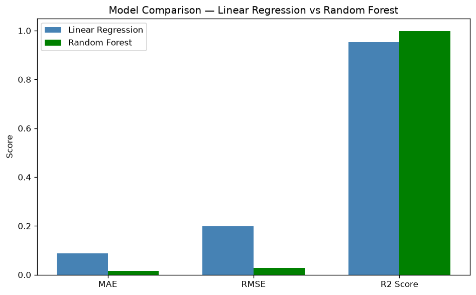
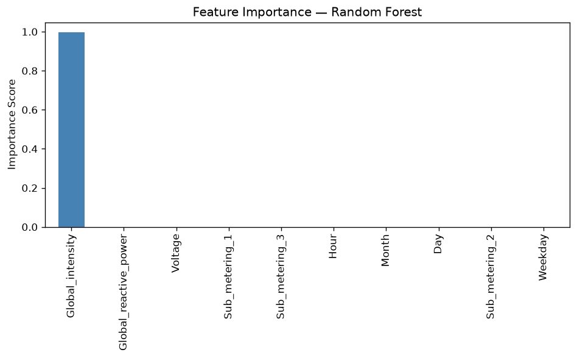

# ⚡ Household Power Consumption — ML Analysis & Prediction

An end-to-end machine learning project that cleans, explores, and models
minute-level household electricity consumption data to **predict power draw**
and **classify usage intensity**. Built as Phase 2 of an AI/ML coursework
project, then refactored from a single notebook into a modular, production-style
Python package.

---

## 📌 Project Overview

Using ~2 million real-world electrical readings from a single household
(UCI *Individual Household Electric Power Consumption* dataset), this project:

1. Cleans and engineers features from raw, messy sensor data
2. Explores consumption patterns through visual analysis
3. Trains and compares **two regression models** to predict `Global_active_power`
4. Trains a **classification model** to bucket usage into Low / Medium / High
   demand tiers — useful for tasks like smart-home alerts or tariff planning
5. Interprets model behaviour via feature importance and peak-usage analysis

---

## 🧠 Skills Showcased

This project was built to demonstrate the full applied ML workflow, not just
model-fitting:

| Area | What was applied |
|---|---|
| **Data Wrangling** | Parsing a large semicolon-delimited file with mixed missing-value markers (`?`), handling ~1.25% missing rows, removing duplicates |
| **Feature Engineering** | Merging `Date` + `Time` into a proper `Datetime`, deriving `Hour`, `Day`, `Month`, `Weekday` to capture temporal usage patterns |
| **Outlier Handling** | IQR-based capping (not deletion) to control the effect of extreme power spikes while preserving dataset size |
| **Exploratory Data Analysis** | Distribution plots, boxplots, correlation heatmaps, pairplots, and time-of-day usage trends using Matplotlib & Seaborn |
| **Regression Modelling** | Linear Regression as an interpretable baseline vs. Random Forest Regressor as a stronger non-linear model |
| **Model Evaluation** | MAE, RMSE, R², actual-vs-predicted scatter plots, residual/error distribution analysis |
| **Model Interpretability** | Random Forest feature importance ranking to explain *what drives power consumption* |
| **Applied Insight Generation** | Peak-usage-hour analysis translating model output into an actionable finding |
| **Classification Modelling** | Reframing a regression target into a 3-class problem (quantile binning) and solving it with K-Nearest Neighbours |
| **Classification Evaluation** | Accuracy, precision/recall/F1 via `classification_report`, confusion matrix visualization |
| **Software Engineering Practices** | Refactoring exploratory notebook code into a clean, documented, reusable Python package (`src/`) with a single CLI entry point (`main.py`), type-hinted functions, dataclasses for results, and separation of concerns (data / viz / models) |

---

## 🗂️ Project Structure

```
household-power-ml/
├── README.md                   # You are here
├── requirements.txt             # Python dependencies
├── .gitignore
├── main.py                      # CLI entry point — runs the full pipeline
│
├── data/
│   └── README.md                # Dataset description + download instructions
│                                 # (raw data file is gitignored — see below)
│
├── notebooks/
│   └── AI_Project_Phase2.ipynb  # Original exploratory notebook (source of truth
│                                 # for the logic now organized under src/)
│
├── src/
│   ├── __init__.py
│   ├── data_preprocessing.py    # Loading, cleaning, feature engineering
│   ├── visualize.py             # All EDA + model evaluation plots
│   ├── train_regression.py      # Linear Regression & Random Forest
│   └── train_classification.py  # KNN usage-class classifier
│
└── outputs/
    ├── figures/                 # Saved plots (generated on run)
    └── models/                  # Saved trained models (.joblib, generated on run)
```

---

## 🔬 Methodology

### 1. Data Preprocessing (`src/data_preprocessing.py`)
- Load the raw `;`-separated file, treating `?` as missing
- Drop missing values and duplicate rows
- Merge `Date` + `Time` → `Datetime`, then extract `Hour`, `Day`, `Month`, `Weekday`
- Cap `Global_active_power` outliers using the IQR method

### 2. Exploratory Data Analysis (`src/visualize.py`)
- Power distribution histogram & boxplot
- Voltage vs. Power scatter plot
- Average usage by hour of day
- Correlation heatmap across all numeric features
- Pairplot of the most correlated variables

### 3. Regression — Predicting Power Draw (`src/train_regression.py`)
Two models are trained on the same 80/20 train/test split and compared head-to-head:

| Model | Why it's included |
|---|---|
| **Linear Regression** | Fast, interpretable baseline |
| **Random Forest Regressor** | Captures non-linear relationships; trained on a 20% sample of the training set with parallelized fitting (`n_jobs=-1`) to keep runtime practical on ~2M rows |

Each model is evaluated with **MAE**, **RMSE**, and **R²**, and diagnosed with
actual-vs-predicted and residual-distribution plots.

Random Forest feature importances are then extracted to identify which
electrical readings most strongly predict overall power draw, and predictions
are aggregated by hour to surface **peak usage periods**.

### 4. Classification — Usage Tiering (`src/train_classification.py`)
`Global_active_power` is binned into three equal-frequency classes
(**Low / Medium / High**) using `pd.qcut`, and a **K-Nearest Neighbours**
classifier (k=5) is trained on electrical + time features to predict the
tier — evaluated with accuracy, a full classification report, and a
confusion matrix.

---

## 🚀 How to Run

### 1. Clone & install dependencies
```bash
git clone https://github.com/<your-username>/household-power-ml.git
cd household-power-ml
pip install -r requirements.txt
```

### 2. Download the dataset
The raw dataset (~130 MB) is not included in this repo. See
[`data/README.md`](data/README.md) for the one-line download command.

### 3. Run the full pipeline
```bash
python main.py --data data/household_power_consumption.txt
```

This will:
- Preprocess the data
- Save all EDA and model evaluation plots to `outputs/figures/`
- Save trained models to `outputs/models/`
- Print evaluation metrics and the model comparison table to the console

### 4. Or explore interactively
```bash
jupyter notebook notebooks/AI_Project_Phase2.ipynb
```

---

## 📊 Results Summary

| Model | Task | Key Metric |
|---|---|---|
| Linear Regression | Predict `Global_active_power` | Baseline MAE / RMSE / R² (see console output) |
| Random Forest Regressor | Predict `Global_active_power` | Improved fit over linear baseline; also yields feature importances |
| K-Nearest Neighbours | Classify usage into Low / Medium / High | Accuracy + per-class precision/recall (see console output) |

> Exact metric values depend on the full dataset and are printed when you run
> `main.py` — see `outputs/figures/model_comparison.png` for a generated
> visual comparison after running the pipeline.




---

## 🛠️ Tech Stack

`Python` · `pandas` · `NumPy` · `scikit-learn` · `Matplotlib` · `Seaborn` · `Jupyter`

---

## 📁 Dataset Citation

Hebrail, G. & Berard, A. (2012). *Individual household electric power
consumption* [Dataset]. UCI Machine Learning Repository.
https://doi.org/10.24432/C58K54

---

## 📄 License

This project is for educational purposes as part of an AI/ML coursework
assignment. Feel free to fork and build on it.
